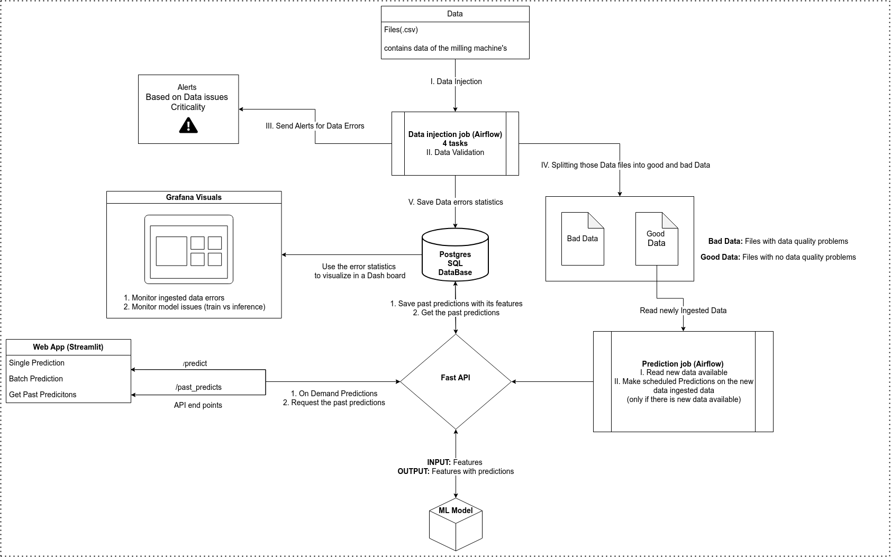

# Equipment Failure Prediction Application

**A scalable machine learning pipeline for on-demand and scheduled predictions, featuring real-time data ingestion, quality validation, and monitoring—all powered by Docker and AWS cloud technologies..**

---
## Table of Contents
1. [Introduction](#introduction)
2. [Features](#features)
3. [Architecture](#architecture)
4. [Technologies Used](#technologies-used)
5. [Installation](#installation)
6. [Usage](#usage)
7. [Project Structure](#project-structure)
8. [cknowledgments](#acknowledgments)
---

## Introduction
A comprehensive machine learning pipeline designed to:
- Provide **on-demand predictions** via a user-friendly web interface.
- Automate **scheduled predictions** using Airflow.
- Ingest and validate data quality using **Great Expectations** or **TensorFlow Data Validation**.
- Monitor data quality and model performance in real-time using **Grafana** dashboards.
- Store predictions and data quality issues in a **PostgreSQL** database.

The pipeline is built with modularity and scalability in mind, leveraging **Docker** for containerization and **AWS** for cloud deployment. It serves as a robust solution for deploying machine learning models in production while ensuring data quality and performance monitoring.

---

## Features
- **User Interface**:
  - Make single or batch predictions via a Streamlit web app.
  - View past predictions with filtering by date and prediction source (web app or scheduled job).
- **Model API**:
  - Expose the ML model via FastAPI for predictions.
  - Save predictions and used features to the database.
  - Retrieve past predictions for visualization.
- **Database**:
  - Store predictions, data quality issues, and ingestion statistics.
- **Data Ingestion Job**:
  - Simulate continuous data flow by ingesting files every minute.
  - Validate data quality and raise alerts for issues.
  - Split data into `good_data` and `bad_data` based on quality.
- **Prediction Job**:
  - Automate predictions every 2 minutes using Airflow.
  - Skip execution if no new data is available.
- **Monitoring Dashboards**:
  - Monitor data quality issues and model performance in real-time using Grafana.
  - Set up alerts for critical issues (e.g., all ingested data has errors, model predicting zero).

---
## Architecture
The project architecture consists of the following components:
1. **User Interface**: Streamlit web app for on-demand predictions and visualization.
2. **Model API**: FastAPI service for serving predictions and saving results.
3. **Database**: PostgreSQL database for storing predictions, data quality issues, and statistics.
4. **Data Ingestion Job**: Airflow DAG for ingesting and validating data.
5. **Prediction Job**: Airflow DAG for scheduled predictions.
6. **Monitoring Dashboards**: Grafana dashboards for real-time monitoring.

*An overview of data flow*

### How Components Interact:
- The **Streamlit UI** interacts with the **FastAPI** service to make predictions and retrieve past predictions.
- The **FastAPI** service saves predictions and used features to the **PostgreSQL** database.
- The **Data Ingestion Job** reads data from the `raw-data` folder, validates it, and splits it into `good_data` and `bad_data` folders.
- The **Prediction Job** checks the `good_data` folder for new files and makes predictions via the **FastAPI** service.
- The **Grafana** dashboards query the database to display real-time insights into data quality and model performance.
---
## Technologies Used
- **Programming Languages**:
  - Python (primary language for all components)
- **Frameworks/Libraries**:
  - Streamlit (User Interface)
  - FastAPI (Model API)
  - PostgreSQL (Database)
  - SQLAlchemy (ORM for database interactions)
  - Airflow (Scheduling for data ingestion and prediction jobs)
  - Great Expectations / TensorFlow Data Validation (Data Validation)
  - Grafana (Monitoring Dashboards)
- **Containerization**:
  - Docker (Containerization of all services)
  - Docker Compose (Orchestration of multi-container setup)
- **Cloud Technologies**:
  - AWS (EC2, S3, RDS, etc. for deployment and storage)
- **Other Tools**:
  - Git (Version control)
  - GitHub (Repository hosting)
  - Pandas, NumPy, Scikit-learn (Data processing and ML modeling)
___`