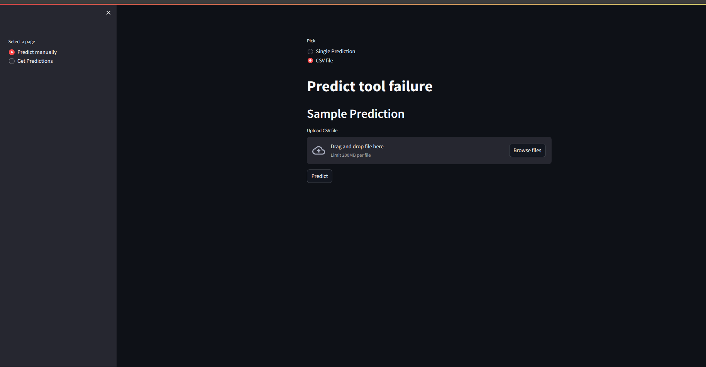

# Equipment Failure Prediction Application

**A scalable machine learning pipeline for on-demand and scheduled predictions, featuring real-time data ingestion, quality validation, and monitoring all powered by Docker and AWS cloud technologies.**

## Table of Contents
1. [Introduction](#introduction)
2. [Features](#features)
3. [Architecture](#architecture)
4. [Technologies Used](#technologies-used)
5. [Project Structure](#project-structure)
6. [Dataset](#about-the-dataset)
7. [ML Model](#about-the-machine-learning-model)
8. [Installation](Installtion) 
9. [Usage](#usage)
10. [Acknowledgments](#acknowledgments)

## Introduction
A comprehensive machine learning pipeline designed to:
- Provide **on-demand predictions** via a user-friendly web interface.
- Automate **scheduled predictions**  
- Ingest and validate data quality using **Great Expectations**.
- Monitor data quality and model performance in real-time using **Grafana** dashboards.
- Store predictions and data quality issues in a **PostgreSQL** database.

The pipeline is built with modularity and scalability in mind, leveraging **Docker** for containerization and **AWS** for cloud deployment. It serves as a robust solution for deploying machine learning models in production while ensuring data quality and performance monitoring.

## Features
- **User Interface**:
  - Make single  or batch predicitons  via a Streamlit web app.
  - View past predictions with filtering by date and prediction source (web app or scheduled job).
  
- **Model API**:
  - Expose the ML model via FastAPI for predictions.
  - Save predictions and used features to the database.
  - Retrieve past predictions for visualization.
- **Database**:
  - Store predictions, data quality issues, and ingestion statistics.
- **Data Ingestion Job**:
  - Simulate continuous data flow by ingesting files every minute.
  - Validate data quality and raise alerts for issues.
  - Split data into `good_data` and `bad_data` based on quality.
  
- **Prediction Job**:
  - Automate predictions every 2 minutes using Airflow.
  - Skip execution if no new data is available.
  
- **Monitoring Dashboards**:
  - Monitor data quality issues and model performance in real-time using Grafana.
  
  - Set up alerts for critical issues (e.g., all ingested data has errors, model predicting zero).
  

## Architecture
*Overview of data flow*


### How Components Interact:
- The **Streamlit UI** interacts with the **FastAPI** service to make predictions and retrieve past predictions.
- The **FastAPI** service saves predictions and used features to the **PostgreSQL** database.
- The **Data Ingestion Job** reads data from the `raw-data` folder, validates it, and splits it into `good_data` and `bad_data` folders.
- The **Prediction Job** checks the `good_data` folder for new files and makes predictions via the **FastAPI** service.
- The **Grafana** dashboards query the database to display real-time insights into data quality and model performance.


## Technologies Used
- **Programming Languages**:
  - Python (primary language for all components)
- **Frameworks/Libraries**:
  - Streamlit (User Interface)
  - FastAPI (Model API)
  - PostgreSQL (Database)
  - SQLAlchemy (ORM for database interactions)
  - Airflow (Scheduling for data ingestion and prediction jobs)
  - Great Expectations / TensorFlow Data Validation (Data Validation)
  - Grafana (Monitoring Dashboards)
- **Containerization**:
  - Docker (Containerization of all services)
  - Docker Compose (Orchestration of multi-container setup)
- **Cloud Technologies**:
  - AWS (EC2, S3, RDS, etc. for deployment and storage)
- **Other Tools**:
  - Git (Version control)
  - GitHub (Repository hosting)
  - Pandas, NumPy, Scikit-learn (Data processing and ML modeling)


## Project Structure
```bash
equipment-failure-prediction/
│── api/                        # FastAPI service
│── dags/                       # Airflow DAGs for automation 
│── data/                       # contains .CSV file used to create model
│── Data_Feed/                  # Raw and processed data
│── dist/                       # installable model
│── equipfailpred/                        # Equipement Failure prediciton Model
│── gx/                         # Greate Expectation suites 
│── models/                     # ML models (for preprocessing data)
│── webapp/                     # Streamlit UI
│── introduce_erros_to_split.py # scripts to create raw-data
│── docker-compose.yml          # Docker setup
│── requirements.txt            # Python dependencies
│── README.md                   # Documentation
```

## About the Dataset

This project utilizes a synthetic dataset modeled after an existing milling machine, consisting of 10,000 data points with 14 features. The dataset includes information such as product quality variants, temperatures, rotational speed, torque, tool wear, and machine failure modes. 

Please note that this is the **original dataset** with additional information and proper attribution. There is at least one other version of this dataset available on Kaggle, uploaded without permission. Please be fair and attribute the original author.

### Dataset Details:
- **UID**: A unique identifier ranging from 1 to 10,000.
- **Product ID**: Consists of a letter (L, M, or H) for low, medium, or high quality variants, with corresponding serial numbers.
- **Type**: Product type, derived from the Product ID column.
- **Air Temperature [K]**: Generated using a random walk process, normalized to a standard deviation of 2 K around 300 K.
- **Process Temperature [K]**: Generated using a random walk process, normalized to a standard deviation of 1 K, added to the air temperature plus 10 K.
- **Rotational Speed [rpm]**: Calculated from a power of 2860 W, overlaid with normal distribution noise.
- **Torque [Nm]**: Normally distributed values with a standard deviation of 10 Nm, with no negative values.
- **Tool Wear [min]**: Quality variants (H/M/L) add 5/3/2 minutes of tool wear during the process.
- **Machine Failure Label**: Indicates if the machine has failed for any of the following failure modes: Tool Wear Failure (TWF), Heat Dissipation Failure (HDF), Power Failure (PWF), Overstrain Failure (OSF), and Random Failures (RNF).

### Failure Modes:
- **Tool Wear Failure (TWF)**: Occurs when the tool is replaced or fails at a randomly selected tool wear time between 200 - 240 minutes (120 instances in dataset).
- **Heat Dissipation Failure (HDF)**: Happens if the air- and process temperatures differ by less than 8.6 K, and the tool's rotational speed is below 1380 rpm (115 instances).
- **Power Failure (PWF)**: Occurs if the product of torque and rotational speed results in a power below 3500 W or above 9000 W (95 instances).
- **Overstrain Failure (OSF)**: Triggered when the product of tool wear and torque exceeds a certain threshold, specific to each product variant (98 instances).
- **Random Failures (RNF)**: Each process has a 0.1% chance to fail, irrespective of its parameters (5 instances).

If at least one of the above failure modes is true, the machine failure label is set to 1.

## Dataset Modification and Model
In this project, I modified the original dataset by merging the five failure classes (Tool Wear Failure, Heat Dissipation Failure, Power Failure, Overstrain Failure, Random Failures) into a single binary class, **`machine_failure`**. This new column indicates whether any failure occurred (`1`) or not (`0`), making the model task a binary classification problem.

### Data Flow and Applications
I also utilized this dataset in various real-world application workflows:
- **Data Injection**: Simulated real-time data injection to mimic the operation of a manufacturing system.
- **Error Introduction**: I tested the model's robustness by introducing synthetic errors, such as missing values and noise.
- **Data Validation**: Employed validation techniques to ensure the dataset's quality before use in training and testing.

### Citation
The original work:
S. Matzka, "Explainable Artificial Intelligence for Predictive Maintenance Applications," 2020 Third International Conference on Artificial Intelligence for Industries (AI4I), 2020, pp. 69-74, doi: [10.1109/AI4I49448.2020.00023](https://doi.org/10.1109/AI4I49448.2020.00023).

## About the Machine Learning Model
In this project, I trained a Random Forest Classifier using the modified dataset described above. The model is designed to predict equipment failure based on the provided features. The training process involved:

### **Data Preprocessing:** 
 Involes 
 -  `LableEncoder` from sikitlearn.
   ```
  ORDINAL = ['Type']
  ```
 - `StandardScaler` from sikitlearn.
  ```
  NUMERICAL = ['Air temperature [K]', 
               'Process temperature [K]', 
               'Rotational speed [rpm]', 
               'Torque [Nm]', 
               'Tool wear [min]']
  ```


### **Model Training:**

The Random Forest Classifier was chosen for its robustness and ability to handle complex, non-linear relationships in the data.

### **Model Evaluation:**

The model was evaluated using metrics such as accuracy, precision, recall, and Area Under the Curve.

- **Accuracy: 98.5%** of the predictions were correct.

- **Precision: 86%** of the predicted failures were actual failures.

- **Recall: 60%** of the actual failures were correctly identified.

- **AUC: The model has an 80%** chance of distinguishing between failure and non-failure cases.

## Limitations
- The current model predicts only whether a failure occurs or not. It does not identify specific failure modes (e.g., Tool Wear Failure, Heat Dissipation Failure).
- If multiple failure modes occur simultaneously, the model will not capture this complexity.
- The dataset may have imbalanced classes, with some failure modes being rare, leading to biased predictions.
- The model’s performance depends heavily on the quality and relevance of the input features.
- The current pipeline may not be optimized for handling extremely high-velocity real-time data streams.
- The model’s predictions may be difficult to interpret for non-technical stakeholders.

## Future Enhancements
- Extend the model to predict specific failure modes and handle machines with multiple failure modes.
- Integrate more sophisticated data validation techniques, such as anomaly detection.
- Implement a pipeline for automated model retraining as new data becomes available.
- Enhance the monitoring system to provide real-time alerts for specific failure modes.


### **Model Deployment:**

The trained model was serialized and packaged into an installable Python module.

The module is stored in the `dist` folder as `equipfailpred-1.0.0.tar.gz`.

Installing the Model Module
To install the model module, navigate to the dist folder and use pip:

```
cd dist
pip install equipfailpred-1.0.0.tar.gz
```
This will install the equipfailpred module, which can be imported and used in your Python scripts or applications.

Using the Model
Once installed, you can use the model to make predictions as follows:

```
from equipfailpred.inference import make_predictions

# Example input features dictionary with units
features = {
    'Product ID': 'L12345',
    'Air temperature [K]': 1230,               # Air temperature in Kelvin
    'Process temperature [K]': 2342,           # Process temperature in Kelvin
    'Rotational speed [rpm]': 9834,            # Rotational speed in revolutions per minute (rpm)
    'Torque [Nm]': 234,                        # Torque in Newton-meters (Nm)
    'Tool wear [min]': 243,                    # Tool wear in minutes (min)
    'Type': 'L',                               # Type of machine or product
    
}

# Make a prediction
prediction = make_predictions(features)
print(f"Prediction: {prediction}")
>>> 'Predictions': 1                             # Predictions (1 for failure, 0 for no failure)
```
## Installation
```bash
# Clone the repository
git clone https://github.com/kuzhalogi/EquipmentFailurePred.git
cd EquipmentFailurePred

# Create and activate a virtual environment
python -m venv predapp
source predapp/bin/activate  # On Windows use `predapp\Scripts\activate`

# Install dependencies
pip install -r requirements.txt

# Set up Docker
docker-compose up -d
```

## Usage

Running the Web Application
```bash
streamlit run app.py
```
Making Predictions via API
```bash
curl -X POST "http://localhost:8000/predict" -H "Content-Type: application/json" -d '{
  "feature1": value1,
  "feature2": value2,
  "feature3": value3
}'
```

Running Airflow Scheduler
```bash
airflow scheduler
```

## Acknowledgments

I would like to express my gratitude to my professor, [**Alaa BAKHTI**](https://www.linkedin.com/in/alaabakhti/), for providing the initial idea and guidance for this academic project. Their insights and support were instrumental in shaping the direction of this work. While I have expanded and tweaked the project to include additional features and improvements, the foundational concept was inspired by their vision.

Additionally, I would like to acknowledge the original authors of the dataset and the various open-source tools and libraries that made this project possible. **Special thanks to the communities behind Streamlit, FastAPI, PostgreSQL, Airflow, Great Expectations, TensorFlow Data Validation, and Grafana for their invaluable contributions to the development of this application.**

**Note:** The containerization process is currently a *work in progress*. While the application is functional and the core components are in place, I am actively working on finalizing the Docker setup and ensuring seamless deployment. Updates will be made to the repository as this process is completed.

